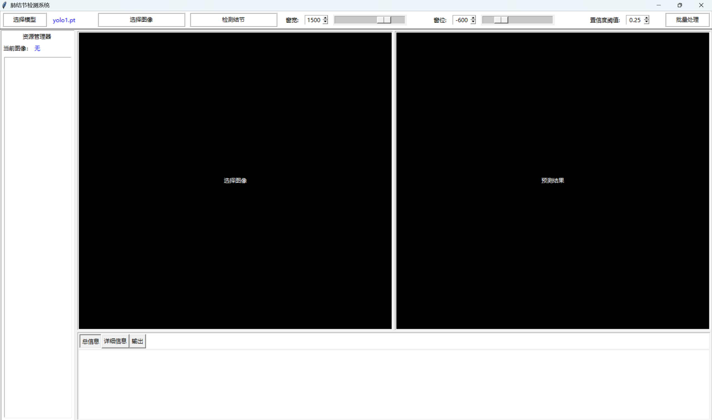
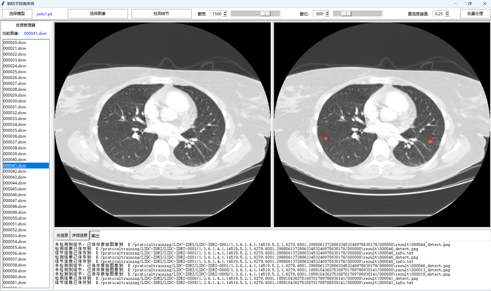
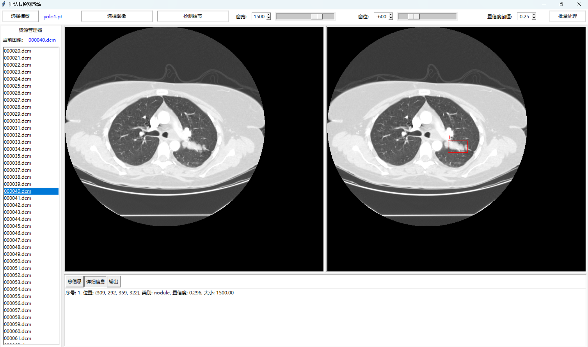
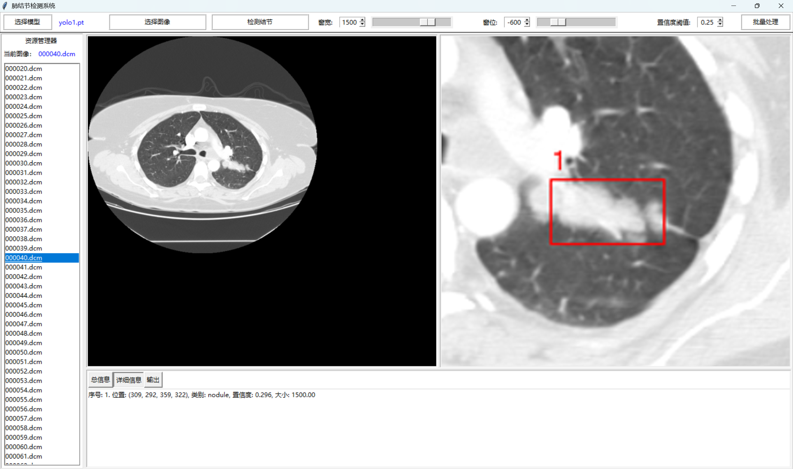

# 基于 YOLO 模型的肺结节计算机辅助检测系统

(Pulmonary Nodule Detection System Based on the YOLO Model)

## 项目简介

本项目是一个基于 CT 影像的肺结节计算机辅助检测系统 (CAD)。系统主要利用深度学习技术，对医疗 CT 扫描切片（DICOM 格式）进行智能分析，精准检测肺结节的数量和位置。该系统旨在为医生提供直观、便捷的辅助诊断工具，简化读片流程并提高诊断效率。

## 系统运行截图

**系统主要界面及初始布局：**


**肺结节检测结果展示：**


**一键批量检测功能：**


**资源管理与图像细节缩放：**


## 主要功能

- **DICOM 图像支持**：直接读取、加载和显示纯医学 DICOM 格式的影像数据。
- **窗宽/窗位实时调节**：内置窗宽（默认 1500）与窗位（默认 -600）的滑动条和输入框，实时刷新转化 DICOM 为可视图像，解决不同显示需求对结节特征的影响。
- **智能结节检测**：支持单图快速推理，并在图像中以红色矩形框和编号标定检测到的肺结节。
- **置信度灵活调节**：支持通过工具栏对模型检测的置信度阈值进行动态修改（默认 0.25）。
- **批量数据处理**：一键“批量处理”功能，可快速对所选文件夹内的所有图像进行自动化检测，配有进度条与可中断操作，并在目标目录生成 `result` 结果文件夹保存分析信息。
- **多维度信息展示**：
  - **总指标**：显示当前检测发现的结节总数。
  - **详细信息**：提供每个结节的对应序号、坐标位置、类别、预测置信度与尺寸大小。
  - **输出日志**：内置程序运行状态的实时输出日志。
- **图像交互式查看**：支持鼠标滚轮对图像进行动态缩放查看细节，按住鼠标左键可拖拽平移，右键单击使视图尺寸复位。
- **内置资源管理器**：左侧具有文件列表管理区，不仅高亮当前操作的图像，还可以直接点击切换其他切片，联动显示已有的检测结果。

## 技术栈与组织架构

### 核心技术与方法

- **深度学习框架**：`PyTorch`
- **目标检测算法**：选用 `YOLO` (Ultralytics v8) 模型。在研发阶段，曾对比测试无监督与 Unet/Unet++ 系列模型，最终由于 YOLOv8 在坐标边框回归和检测上的优异表现，选定 **YOLOv8m** 配合迁移学习机制作为最优识别方案。
- **图像处理**：依赖 `Pydicom` 和 `Numpy` 进行原片像素矩阵提取和归一化解析，结合 `OpenCV` 与 `Pillow` 组件实现渲染与重绘。
- **GUI 界面开发**：采用 Python 标准库 `Tkinter`，构建跨平台且无额外浏览器依赖的完整桌面级软件外观。
- **多进程与性能优化**：通过隔离 `OMP` 和 `TORCH` 的多线程抢占，保障模型推理时 UI 不发生卡顿或由于并发读写导致的崩溃。
- **一键打包部署**：项目最终通过 `Pyinstaller` 完整转换为脱离 Python 环境的 `.exe` 独立可执行程序。

### 系统组织架构

系统由几大核心功能模块组合：

1. **输入与预处理模块**：载入指定的 `.dcm` 切片 -> 读取 Pixel Data -> 应用窗宽窗位变换 -> 转存用于推理的 `png` 和显示缓冲。
2. **逻辑与推理模块**：加载 YOLO 权重文件 (`yolo1.pt` 等) -> 对有效图像做 Resize 和特征提取 -> 执行 Non-Maximum Suppression (非极大值抑制，IOU=0.45) 提纯预测框。
3. **数据持久化模块**：将结果坐标通过反归一化还原后，存储为专属文本信息 (`00000X_info.txt`)，沉淀至自动建立的 `result/` 子目录。
4. **前端交互与视图模块 (CAD GUI)**：工具栏控制视图、中心画布区(Canvas) 的缩放事件监听、左侧目录树映射、以及右下方数据文本面板(总数/细节/日志)的挂载和更新。

## 环境搭建与使用说明

### 1. 环境依赖配置

若进行源码级运行，请确保本地已安装 Python 3.8+，并可通过内置的 `requirements.txt` 一键安装所有依赖包：

```bash
pip install -r requirements.txt
```

### 2. 获取与运行系统

可以通过命令行直接从项目根目录拉起应用程序界面的主入口：

```bash
python main.py
```

*(注：如果已有经 `Pyinstaller` 构建的 `.exe` 文件，双击运行即可，无需执行环境配置步骤)*

### 3. 操作流程指南

1. **加载模型**：点击工具栏的**「选择模型」**按钮，选取本项目目录中预训练好的 YOLO 模型文件（例如 `yolo1.pt` 或 `yolo2.pt`）。
2. **选择图像**：点击**「选择图像」**，导入需要诊断的 DICOM (`.dcm`) 切片图像。图像会在系统左侧列表及中间画布区展示。
3. **参数微调 (可选)**：根据画面显色清晰度，拖拉**「窗宽」**和**「窗位」**滑块，以突显疑似结节区域；或调整**「置信度阈值」**来过滤预测。
4. **结节检测**：
   - **单张**：点击**「检测结节」**按钮，系统会调用模型进行诊断，随后在右侧画布描绘红色标定框，并在信息区记录分析数值。
   - **批量**：点击**「批量处理」**按钮，系统将自动依次处理左侧资源管理器中的所有可用 DICOM 文件，并将所有记录和检测框图归档至原目录下的 `result/` 内。
5. **结果复查**：通过左侧的文件区列表，自由点击切换不同切片，回顾对应的可视化标定图与文本诊断数据。支持在画布中通过鼠标自由缩放查看。
